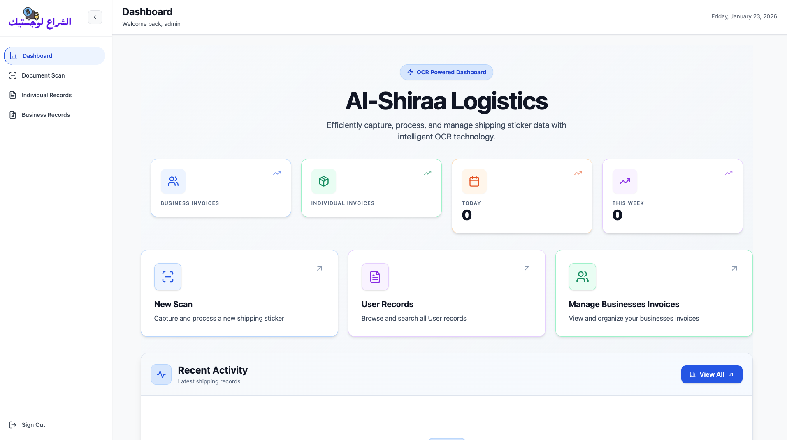

# الشراع لوجستيك | Al-Shiraa Logistics

AI-powered web app to scan shipping stickers & invoices using **Google Gemini API** (primary OCR) + Tesseract.js fallback. Track individual & business shipments with dashboard stats, search, CSV export.

![Dashboard]


## ✨ Features

- Upload / camera capture of shipping stickers
- **Gemini API** extracts: barcode, sender, receiver, weight (KG), pieces, date, client/business details
- Tesseract.js as quick/low-cost fallback
- Separate flows: Individual vs Business records
- Real-time dashboard (records count, total KG, total pieces)
- Search/filter + CSV export
- Admin auth (JWT)

```bash 🚀 Quick Start
cd ocr.web.com
cp .env
npm i
npm run dev

🛠 Tech Stack
Frontend: React, Vite, Tailwind, lucide-react, framer-motion, Compressor.js (image optimize), react-hot-toast
Backend: Node.js, Express, Mongoose, Cloudinary (images), JWT, Multer
OCR: Google Gemini API (main – multimodal vision), Tesseract.js (fallback)

```
