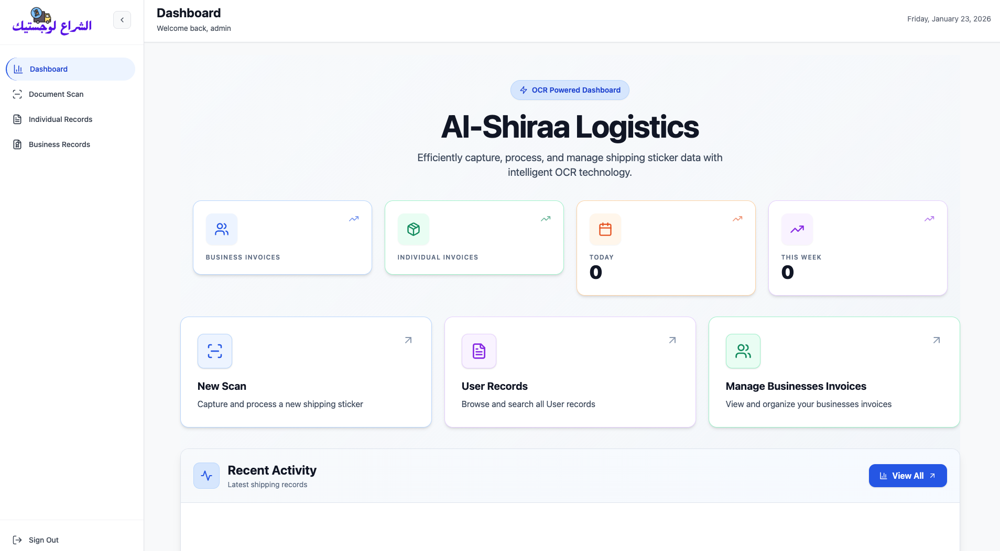

# Dashboard Page

The main landing page after login — gives a quick overview of the system status.

## What you see

Top section:

- Welcome back, admin
- Current date (e.g. Friday, January 23, 2026)

Central title:

- Al-Shiraa Logistics
- Tagline: "Efficiently capture, process, and manage shipping sticker data with intelligent OCR technology."

Four stat cards:

- BUSINESS INVOICES → total count + trend arrow
- INDIVIDUAL INVOICES → total count + trend arrow
- TODAY → number of scans today
- THIS WEEK → number of scans this week

Three action cards:

- New Scan → quick link to start scanning
- User Records → go to all individual + business records
- Manage Businesses Invoices → go to business section

Bottom section:

- Recent Activity → list of latest scans (if any)
- "View All" button

When no data exists → friendly empty states appear.

## Main Dashboard

