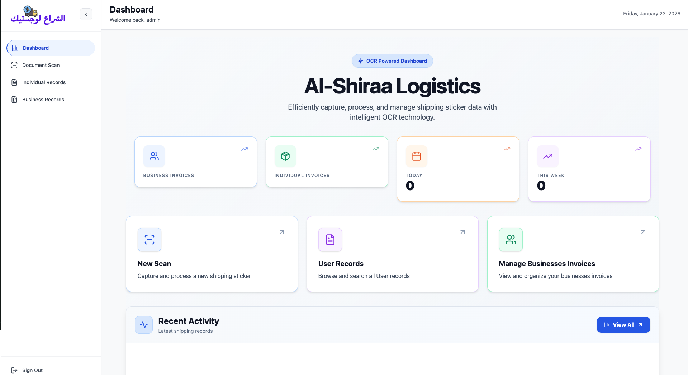
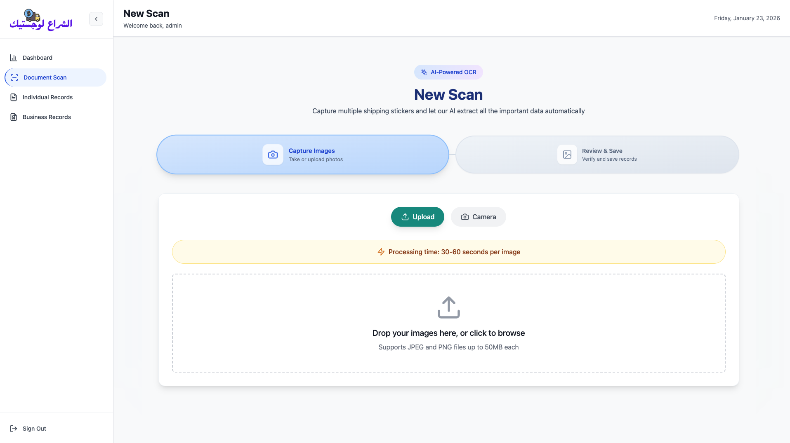
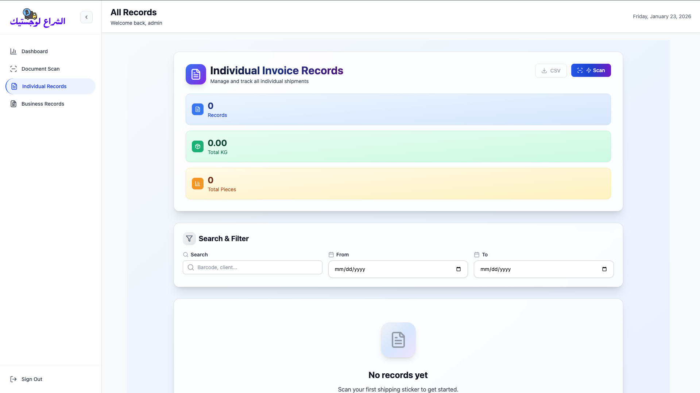
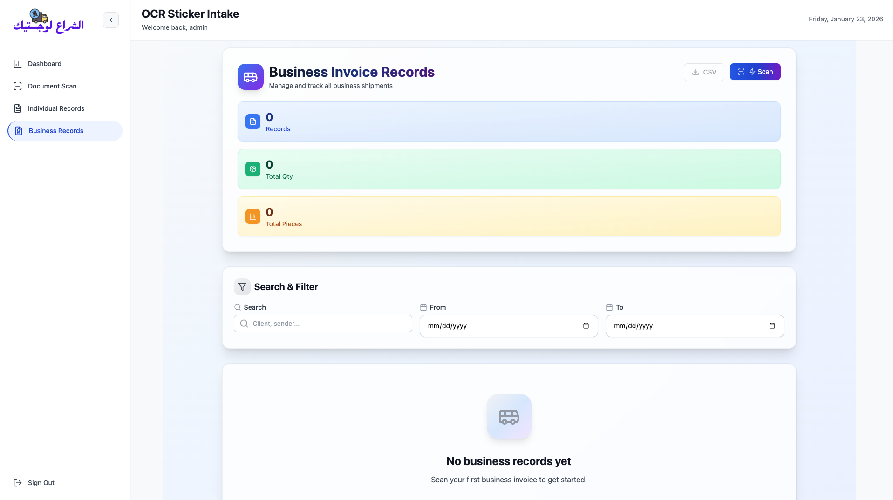

# Frontend – Al-Shiraa Logistics

This is the **client-side** (browser) part of the application — built with **React**, **Vite**, **Tailwind CSS**, and several helpful libraries.

**Main purpose**  
Allow admin users to:

- View overview statistics
- Scan new shipping stickers / invoices using camera or upload
- Review AI-extracted data
- Browse, search and export individual & business shipment records

**Live preview URL** (when running locally): http://localhost:5173  
**Production URL**: http://ec2-3-28-192-218.me-central-1.compute.amazonaws.com/

## Core Features & Navigation

Sidebar menu:

- Dashboard → Overview & stats
- Document Scan → Start new OCR scan
- Individual Records → List of personal / small shipments
- Business Records → List of company / bulk invoices

All pages show:

- Welcome message + current date
- Admin name
- Sign Out button (bottom)

## Main Dashboard

## Document/Sticker Scan

## Individual Document/Sticker Scan

## Business/Multi Document/Sticker Scan

