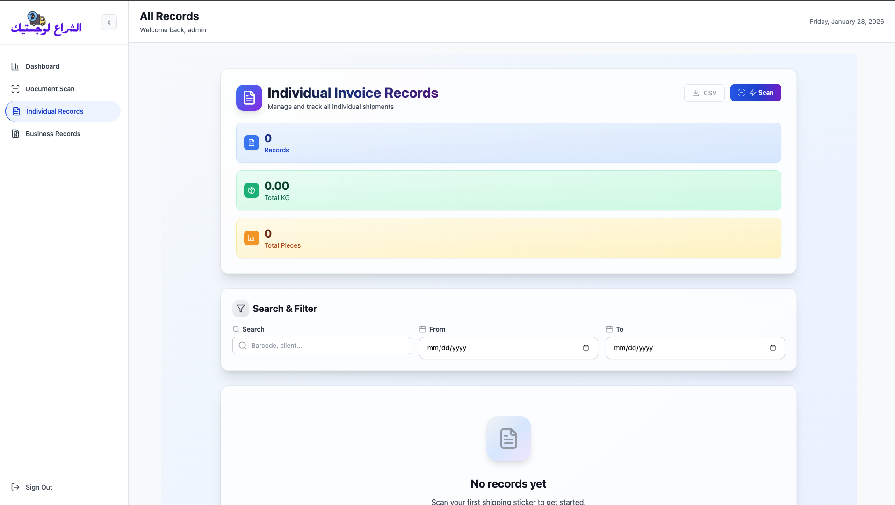

# Individual Records Page

Shows all scanned individual (personal/small) shipments.

## Main elements

Top card:

- Individual Invoice Records
- Current count (e.g. 0 Records)
- Total KG (weight)
- Total Pieces

Buttons:

- Download CSV → exports filtered/current view
- Scan → jumps to New Scan page

Search & Filter bar:

- Search by barcode, client name, etc.
- Date range picker (From → To)

When empty:

- "No records yet"
- "Scan your first shipping sticker to get started."

Table (when records exist):

- Columns: Barcode, Sender, Receiver, Weight, Pieces, Date, Image preview/link, Actions (view/edit/delete if implemented)

Same layout exists for **Business Records** page, but focused on company invoices (different title and placeholder text).

## Individual Records

