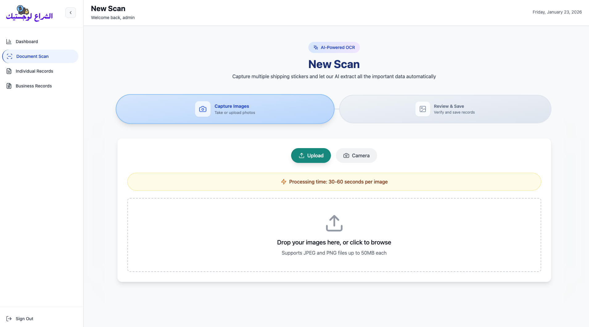

# New Scan Page – Document Scan

The core feature: capture and process a new shipping sticker / invoice.

## Step-by-step flow

1. **Capture Images section**
   - Two tabs/steps: "Capture Images" → "Review & Save"
   - Big area: "Drop your images here, or click to browse"
   - Supports JPEG / PNG up to 50MB each
   - Buttons: Upload | Camera (opens device camera)

2. **Processing info**
   - "Processing time: 30–60 seconds per image"
   - Shows spinner / progress when submitting

3. After upload → Review step
   - AI-extracted fields appear (barcode, sender, receiver, weight kg, pieces, date, etc.)
   - User can edit incorrect values
   - Image preview shown
   - Confirm / Save button → sends to backend → adds to records

4. Success → toast notification + redirect or refresh list

This page uses:

- Compressor.js → reduces image size before upload
- Tesseract.js → optional quick client-side preview (fallback)
- react-hot-toast → success/error messages
- Gemini Model 3

## New Scan Capture/Upload & Review the Scanned Doc

